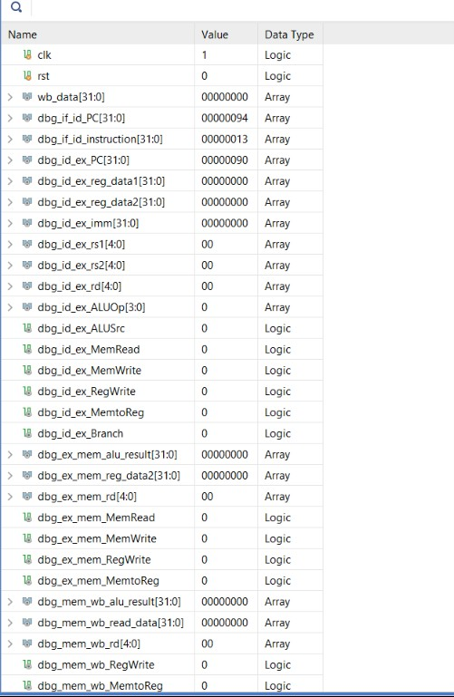
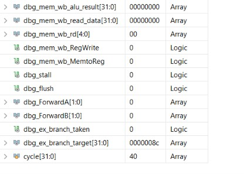
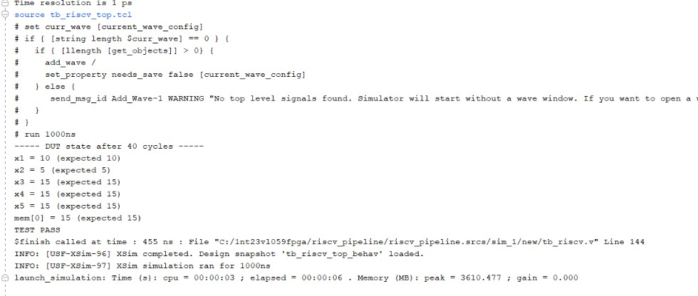
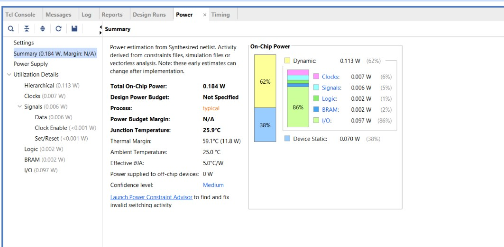
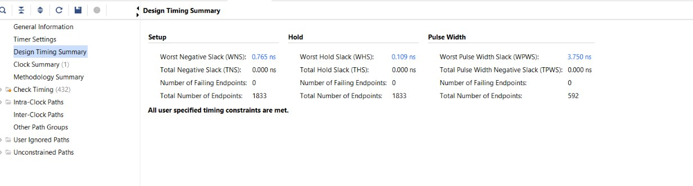
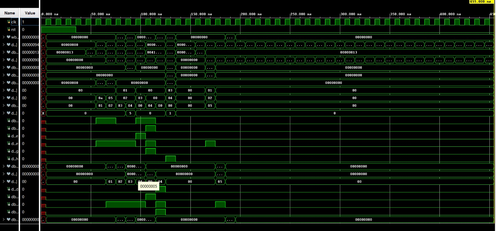
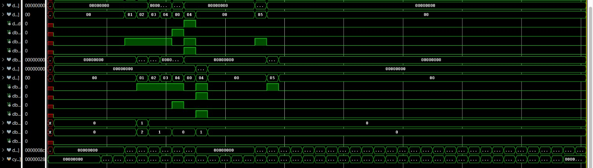

# Low-Power 32-Bit RISC-V Processor (Artix-7)

## 📖 Overview
This project implements a **5-stage pipelined RISC-V processor** optimized for **low power** and **timing closure** on Xilinx Artix-7 FPGA.  
It demonstrates how careful micro-architectural choices (branch resolution in EX stage, operand isolation, NOP masking) can deliver both performance and energy efficiency.

## ⚙️ Features
- 5-stage pipeline (IF, ID, EX, MEM, WB)
- Hazard detection and forwarding
- Branch resolution in EX stage
- Operand isolation and NOP masking for reduced dynamic switching
- Verified at **100 MHz** with clean timing closure

## ⏱ Timing Results
- Worst Negative Slack (WNS): **+0.765 ns**  
- Total Negative Slack (TNS): **0.000 ns**  
- Worst Hold Slack (WHS): **+0.109 ns**  
- Pulse Width Slack (WPWS): **+3.750 ns**  
- ✅ All user-specified timing constraints met

## 🔋 Power Results
- **Total Power:** ~0.18 W  
- **Dynamic:** 0.113 W (62%)  
- **Static:** 0.070 W (38%)  
- Core logic + BRAM consumption negligible; I/O dominates during debug (expected)

## 🧪 Verification
- Automated testbench passed ✅  
- Registers: x1=10, x2=5, x3=15, x4=15, x5=15  
- Memory[0]=15 → matches expected program behavior  
- Simulation log: **TEST PASS after 40 cycles**

## 📂 Repository Structure
riscv-pipeline/
│
├── src/                # Verilog source files (riscv_pipeline.v, alu.v, etc.)
├── tb/                 # Testbench files (tb_riscv.v)
├── constraints/        # Timing constraints (riscv_pipeline.xdc)
├── docs/               # Documentation and diagrams
│   ├── RISC-5object.jpg
│   ├── RISC-5object1.jpg
│   ├── RISC-5output.jpg
│   ├── RISC-5power.jpg
│   ├── RISC-5timing.jpg
│   ├── RISC-5waveform.jpg
│   └── RISC-5waveform1.jpg
└── README.md           # Project overview

Code

## 🖼 Diagrams
Architecture overview:  


Pipeline stages:  


Simulation output:  


Power breakdown:  


Timing summary:  


Waveforms:  
  


## 📑 Constraints
```tcl
# Primary system clock at 100 MHz
create_clock -period 10.000 [get_ports clk]

# Debug signals marked as false paths
set_false_path -to [get_ports -filter {NAME =~ "dbg_*"}]

# Retiming enabled for synthesis
set_property STEPS.SYNTH_DESIGN.ARGS.RETIMING true [get_runs synth_1]
